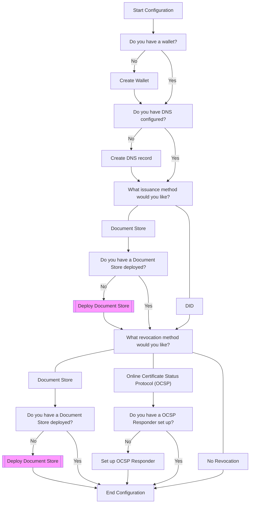
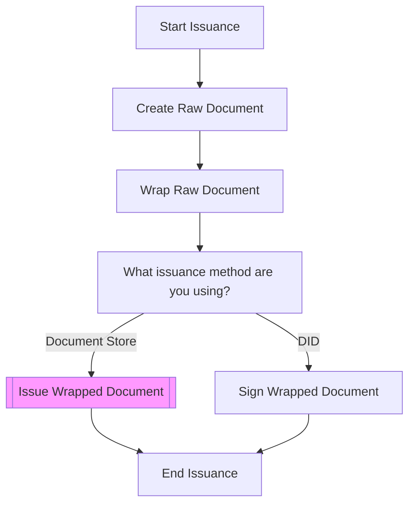
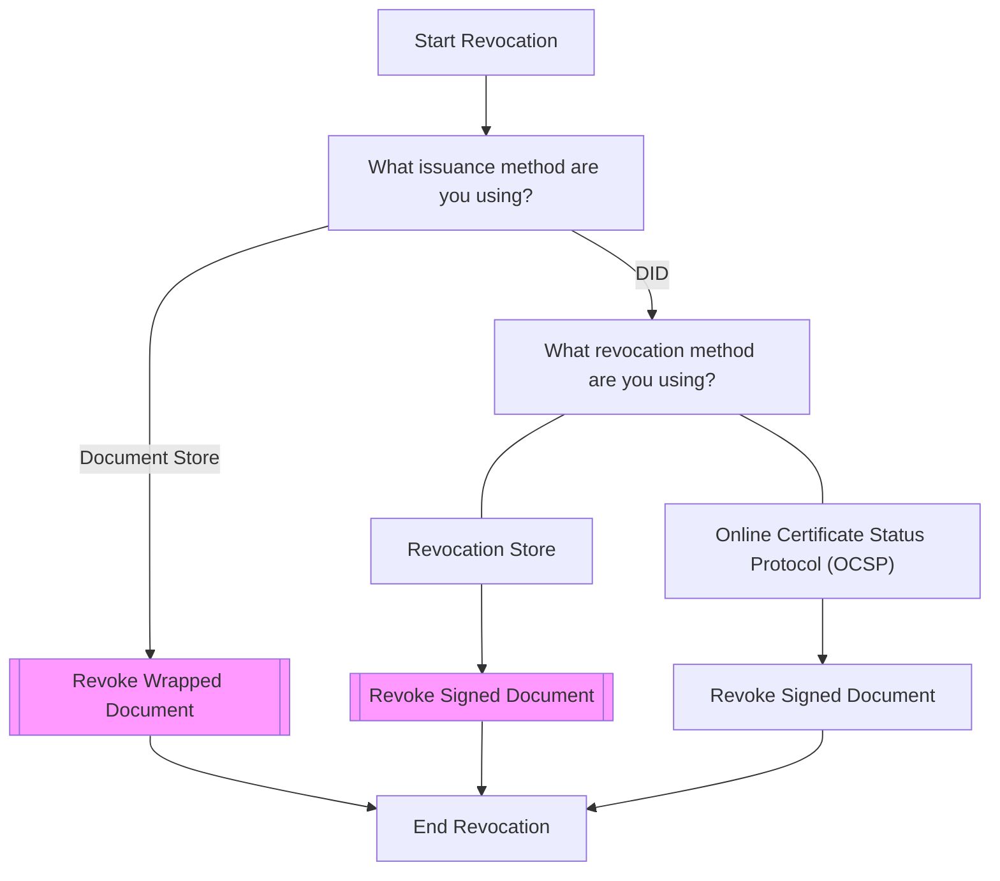
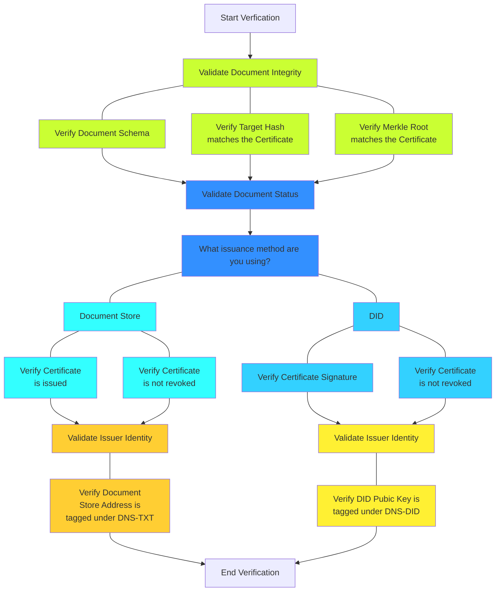

# About

This guide will explain on the usage of OpenAttestation Verifiable Credentials (VC) and how to use its various libraries to issue, revoke and verify an OpenAttestation conformance VC.

A number of different libraries will be utilized to achieve this objective. They include;

1. [OpenAttestation CLI](https://github.com/Open-Attestation/open-attestation-cli)
2. [OpenAttestation Framework](https://github.com/Open-Attestation/open-attestation)
3. [OpenAttestation Encryption Framework](https://github.com/Open-Attestation/oa-encryption)
4. [OpenAttestation Verify Framework](https://github.com/Open-Attestation/oa-verify)
5. [OpenAttestation Document Store Framework](https://github.com/Open-Attestation/document-store)

# Installation

1. Make a copy of this repository
2. In project root folder, open a terminal and run `npm install` to install the dependencies
3. Run `npm install -g @govtechsg/open-attestation-cli` to enable OpenAttestation CLI functionality

## Environment Variables

An example of the [environment variables file](samples/env-sample) is included in the samples folder.

| Name                   | Required | Description                                                                                   |
| ---------------------- | :------: | --------------------------------------------------------------------------------------------- |
| ISSUANCE               |   Yes    | The VC Issuance Method, `document-store` or `did`.                                            |
| REVOCATION             |    No    | The VC Revocation Method, `document-store` or `ocsp`. If empty, `none` method will be used.   |
| NETWORK_ID             |   Yes    | The network ID of the Blockchain to connect to, see below for the list of networks supported. |
| PROVIDER_ENDPOINT_TYPE |   Yes    | The provider of the RPC URL to connect to the Blockchain. (E.g. Infura, Alchemy, JSONRPC)     |
| PROVIDER_ENDPOINT_URL  |   Yes    | The RPC URL to connect to the Blockchain. (E.g. Infura, Alchemy)                              |
| PROVIDER_API_KEY       |   Yes    | The API Key for the RPC URL to connect to the Blockchain. (E.g. Infura, Alchemy)              |
| WALLET_PRIV            |    No    | The Wallet Private Key of the Issuer. If empty, a wallet will be generated.                   |
| DNS                    |    No    | The DNS Record of the Issuer. If empty, a temporary DNS Record will be set up.                |

### Supported Networks

| Network ID | Network Name     |
| :--------: | ---------------- |
|     1      | Ethereum Mainnet |
|     5      | Goerli Testnet   |
|    137     | Polygon Mainnet  |
|   80001    | Mumbai Tesnet    |

# Documents

## Verifiable vs Transferable

A **Verifiable Document** contains machine-readable data that is stored in a `.json` file. It can contains data such as a claim of the issuer's identity, document store smart contract address and other miscellaneous metadata. The issuer identity and data integrity can be verified independently from the issuer.

A **Transferable Document** extends on Verifiable Document to allow a document to have an owner, which can be transferred to a different owner at a later point. It can be used for documents such as Title Deeds and Bill of Ladings.

This guide will focus on Verifiable Documents instead of Transferable Documents.

## Document Types

|                                          Type                                           | Description                                                                                          |
| :-------------------------------------------------------------------------------------: | ---------------------------------------------------------------------------------------------------- |
|                        [Basic](samples/documents/document.json)                         | An OpenAttestation conformance Document without Issuer information                                   |
|           [Raw](samples/raw-documents/raw-document-did-revoke-docstore.json)            | An OpenAttestation conformance Document                                                              |
|     [Wrapped](samples/wrapped-documents/wrapped-document-did-revoke-docstore.json)      | An OpenAttestation conformance Document with Checksum fields as `signature`                          |
|         [Signed](samples/signed-documents/signed-document-revoke-docstore.json)         | An OpenAttestation conformance Document with Checksum fields as `signature` and Signature as `proof` |
| [Encrypted](samples/encrypted-documents/encrypted-signed-document-revoke-docstore.json) | An OpenAttestation conformance Encrypted Document                                                                |

## Verifiable Credentials Permutations

|       OpenAttestation Version 2 | Document Store Issuance | DID Issuance |
| ----------------------------: | :---------------------: | :----------: |
|             **No Revocation** |           No            |     Yes      |
| **Document Store Revocation** |           Yes           |     Yes      |
|           **OCSP Revocation** |           No            |     Yes      |

# Process Flows

## Configuration Flow



## Issuance Flow



## Revocation Flow



## Verification Flow



# Scripts

Detailed explainations are included with each function in the scripts below.

1. [OpenAttestation Helper](scripts/oa-helper.js)
2. [OpenAttestation Framework](scripts/open-attestation.js)
3. [OpenAttestation Encryption Framework](scripts/oa-encryption.js)
4. [OpenAttestation Verify Framework](scripts/oa-verify.js)
5. [OpenAttestation Document Store Framework](scripts/oa-document-store.js)

# Usage

## Configuration

### Creating Wallet

`createWallet` takes in 3 parameters and return an ethers wallet instance. The 3 parameters are whether the wallet should randomly generated, an ethers provider instance, and a wallet private key. If a wallet should be randomly generated, the wallet private key is not required.

```javascript
const OAHelper = require(`./scripts/oa-helper.js`);

var provider = await OAHelper.getProvider(providerURL, networkId);
var wallet = await OAHelper.createWallet(true, provider); // random
var wallet = await OAHelper.createWallet(false, provider, walletPrivateKey); // from a private key
```

### Creating Temporary DNS Record

`createTempDNSRecord` takes in 3 parameters and return a temporary DNS text record. The 3 parameters are if the DNS is for DID issuance, a wallet address, and a blockchain network ID. If the dns is for DID issuance, the blockchain network ID is not required.

```javascript
const OAHelper = require(`./scripts/oa-helper.js`);

var dns = await OAHelper.createTempDNSRecord(true, walletAddr, networkId); // document store
var dns = await OAHelper.createTempDNSRecord(false, walletAddr); // did
```

### Document Store Issuance Method

If issuance method is via Document Store, check if there is already a valid Document Store. If not, check if the wallet has at least 0.01 ETH for deployment fee. If so, `deployDocumentStore` takes in 2 parameters to deploy a new Document Store. The 2 parameters are a Document Factory contract instance and the Document Store name.

```javascript
const OAHelper = require(`./scripts/oa-helper.js`);
const OADocumentStore = require(`./scripts/oa-document-store.js`);

var provider = await OAHelper.getProvider(providerURL, networkId);
var docFactoryInstance = await OAHelper.getContractInstance(docFactoryAddr, docFactoryABI, wallet);
var docStoreAddr = await OAHelper.getDocumentStoreAddr(docFactoryInstance, walletAddr);
var ownableInstance = await OAHelper.getContractInstance(docStoreAddr, ownableABI, wallet);
var docStoreOwner = await OADocumentStore.owner(ownableInstance);
if (docStoreAddr == `0x0000000000000000000000000000000000000000` || docStoreOwner != walletAddr) {
  var walletBalance = await provider.getBalance(walletAddr);
  if (walletBalance.gte(`10000000000000000`)) await OAHelper.deployDocumentStore(docFactoryInstance, docStoreName);
  else throw new Error(`Insufficient funds in wallet!`);
}
```

### Revocation Method

#### Document Store

If revocation method is via Document Store, check if there is already a valid Document Store. If not, check if the wallet has at least 0.01 ETH for deployment fee. If so, `deployDocumentStore` takes in 2 parameters to deploy a new Document Store. The 2 parameters are a Document Factory contract instance and the Document Store name.

```javascript
const OAHelper = require(`./scripts/oa-helper.js`);
const OADocumentStore = require(`./scripts/oa-document-store.js`);

var provider = await OAHelper.getProvider(providerURL, networkId);
var docFactoryInstance = await OAHelper.getContractInstance(docFactoryAddr, docFactoryABI, wallet);
var docStoreAddr = await OAHelper.getDocumentStoreAddr(docFactoryInstance, walletAddr);
var ownableInstance = await OAHelper.getContractInstance(docStoreAddr, ownableABI, wallet);
var docStoreOwner = await OADocumentStore.owner(ownableInstance);
if (docStoreAddr == `0x0000000000000000000000000000000000000000` || docStoreOwner != walletAddr) {
  var walletBalance = await provider.getBalance(walletAddr);
  if (walletBalance.gte(`10000000000000000`)) await OAHelper.deployDocumentStore(docFactoryInstance, docStoreName);
  else throw new Error(`Insufficient funds in wallet!`);
}
```

#### Online Certificate Status Protocol (OCSP)

WIP

## Issuance

### Creating Raw Document

Depending on the issuance and revocation methods, different raw documents will be created. `createRawDocument` takes in 3 parameters and will return a raw document that is conformance to OpenAttestation standards. The 3 parameters are raw document permutation, document, and the issuer options. The difference between a document and a raw document is that a raw document will include the issuer information.

Below are the raw document permutations;

1. Document Store issuance
2. DID issuance and No revocation
3. DID issuance and Document Store revocation
4. DID issuance and OCSP revocation

```javascript
const OAHelper = require(`./scripts/oa-helper.js`);

var options = {
  name: `Demo Issuer`,
  docStoreAddr: docStoreAddr,
  ocsp: ocsp,
  dns: dns,
  walletAddr: walletAddr,
};
var rawDocument = await OAHelper.createRawDocument(1, document, options); // document store issuance
var rawDocument = await OAHelper.createRawDocument(2, document, options); // did issuance and no revocation
var rawDocument = await OAHelper.createRawDocument(3, document, options); // did issuance and document store revocation
var rawDocument = await OAHelper.createRawDocument(4, document, options); // did issuance and ocsp revocation
```

### Creating Wrapped Document

`wrap` takes in 1 parameter and will return wrapped documents that are conformance to OpenAttestation standards. The parameter is an array of raw documents. The difference between a raw document and a wrapped document is that the fields of a wrapped document will include checksum values along with the `signature` object.

```javascript
const OpenAttestation = require(`./scripts/open-attestation.js`);

var wrappedDocuments = await OpenAttestation.wrap(rawDocuments);
```

### Issuing Wrapped Document

#### Document Store Issuance

`issue` takes in 2 parameters and will return a boolean result of the blockchain transaction. The 2 parameters are a Document Store contract instance and the Merkle Root of a wrapped document.

```javascript
const OADocumentStore = require(`./scripts/oa-document-store.js`);

var documentStore = await OADocumentStore.connectDocumentStore(docStoreAddr, wallet);
for (let i = 0; i < wrappedDocuments.length; i++) {
  await OADocumentStore.issue(documentStore, `0x${wrappedDocuments[i].signature.merkleRoot}`);
}
```

#### DID Issuance

`sign` will take in 2 parameters and will return a signed document that is conformance to OpenAttestation standards. The 2 parameters are a wrapped document and an ethers wallet instance. The difference between a wrapped document and a signed document is that a signed document will include an issuer's signature in a `proof` object.

```javascript
const OpenAttestation = require(`./scripts/open-attestation.js`);

for (let i = 0; i < wrappedDocuments.length; i++) {
  var signedDocument = await OpenAttestation.sign(wrappedDocuments[i], wallet);
}
```

## Revocation

#### Document Store Issuance or Revocation

`revoke` takes in 2 parameters and will return a boolean result of the blockchain transaction. The 2 parameters are a Document Store contract instance and the Merkle Root of a wrapped document.

```javascript
const OAHelper = require(`./scripts/oa-helper.js`);
const OADocumentStore = require(`./scripts/oa-document-store.js`);

var docStoreInstance = await OAHelper.getContractInstance(docStoreAddr, docStoreABI, wallet);
await OADocumentStore.revoke(documentStore, `0x${wrappedDocuments[i].signature.merkleRoot}`);
```

#### OCSP Revocation

WIP

## Transmission

### Optional, Obfuscating Wrapped or Signed Document

`obfuscate` takes in 2 parameters and will return an obfuscated document that is conformance to OpenAttestation standards. The 2 parameters are a wrapped or signed document and the key of the key-value pair to be obfuscated. The difference between a wrapped or signed document and an obfuscated document is that an obfuscated document will include the obfuscated data in a `privacy` object.

```javascript
const OpenAttestation = require(`./scripts/open-attestation.js`);

var obfuscatedDoc = await OpenAttestation.obfuscate(wrappedDocument, `uselessField`); // document store issuance
var obfuscatedDoc = await OpenAttestation.obfuscate(signedDocument, `uselessField`); // did issuance
```

### Encrypting Wrapped or Signed Document

`encrypt` will take in 2 parameters and will return an encrypted document. The 2 parameters are a wrapped or signed document and the encryption key. If the encryption key is not provided, a random encryption key will be generated to encrypt the document.

```javascript
const OAEncryption = require(`./scripts/oa-encryption.js`);

var encryptedDoc = await OAEncryption.encrypt(wrappedDocument, encryptionKey); // document store issuance
var encryptedDoc = await OAEncryption.encrypt(signedDocument, encryptionKey); // did issuance
```

### Encoding Encrypted Document

`encode` will take in 1 parameter and will return a base64 string. The parameter is typically an encrypted document.

```javascript
const OAEncryption = require(`./scripts/oa-encryption.js`);

var encodedDoc = await OAEncryption.encode(encryptedDoc);
```

### Decoding Encoded Document

`encode` will take in 1 parameter and will return an encrypted document. The parameter is an encoded document base64 string.

```javascript
const OAEncryption = require(`./scripts/oa-encryption.js`);

var decodedDoc = await OAEncryption.decode(encodedDoc);
```

### Decrypting Encrypted Document

`decrypt` will take in 1 parameter and will return a wrapped or signed document. The parameter is an encrypted document.

```javascript
const OAEncryption = require(`./scripts/oa-encryption.js`);

var decryptedDoc = await OAEncryption.decrypt(decodedDoc);
```

## Verification

`verifyDocument` takes in 1 parameter and will return the verification result. The parameter is a wrapped or signed document. This function will verify all 3 requirements of a OpenAttestation document, Document Integrity, Document Status and Issuer Identity.

```javascript
const OAVerify = require(`./scripts/oa-verify.js`);

await OAVerify.verifyDocument(wrappedDocument); // document store issuance
await OAVerify.verifyDocument(signedDocument); // did issuance
```

### Document Integrity

`verifyDocumentIntegrity` takes in 1 parameter and will return the Document Integrity verification result. The parameter is a wrapped or signed document.

```javascript
const OAVerify = require(`./scripts/oa-verify.js`);

await OAVerify.verifyDocumentIntegrity(wrappedDocument); // document store issuance
await OAVerify.verifyDocumentIntegrity(signedDocument); // did issuance
```

### Document Status

`verifyDocumentStatus` takes in 1 parameter and will return the Document Status verification result. The parameter is a wrapped or signed document.

```javascript
const OAVerify = require(`./scripts/oa-verify.js`);

await OAVerify.verifyDocumentStatus(wrappedDocument); // document store issuance
await OAVerify.verifyDocumentStatus(signedDocument); // did issuance
```

### Issuer Identity

`verifyDocumentIssuer` takes in 1 parameter and will return the Issuer Identity verification result. The parameter is a wrapped or signed document.

```javascript
const OAVerify = require(`./scripts/oa-verify.js`);

await OAVerify.verifyDocumentIssuer(wrappedDocument); // document store issuance
await OAVerify.verifyDocumentIssuer(signedDocument); // did issuance
```

# Testing

1. Run `npm start` to test configuration, issuance, transmission, and verification of a document.
2. Run `npm run revoke` to test revocation.

# Tools

1. [OpenAttestation Frontend Toolkit](https://toolkit.openattestation.com/)
2. [TradeTrust Viewer](https://rinkeby.tradetrust.io/verify)

# References

1. [OpenAttestation Verifiable Credentials - Document Store Tutorial](https://www.openattestation.com/docs/integrator-section/verifiable-document/ethereum/document-store-overview)
2. [OpenAttestation Verifiable Credentials - DID Tutorial](https://www.openattestation.com/docs/integrator-section/verifiable-document/ethereum/document-store-overview)
3. [OpenAttestation CLI Guide](https://www.openattestation.com/docs/developer-section/libraries/remote-files/open-attestation-cli)
4. [OpenAttestation Framework Guide](https://www.openattestation.com/docs/developer-section/libraries/remote-files/open-attestation/)
5. [OpenAttestation Encryption Framework Guide](https://www.openattestation.com/docs/developer-section/libraries/remote-files/open-attestation-encryption)
6. [OpenAttestation Verify Framework Guide](https://www.openattestation.com/docs/developer-section/libraries/remote-files/open-attestation-verify)
7. [OpenAttestation Document Store Framework Guide](https://www.openattestation.com/docs/developer-section/libraries/remote-files/document-store)
