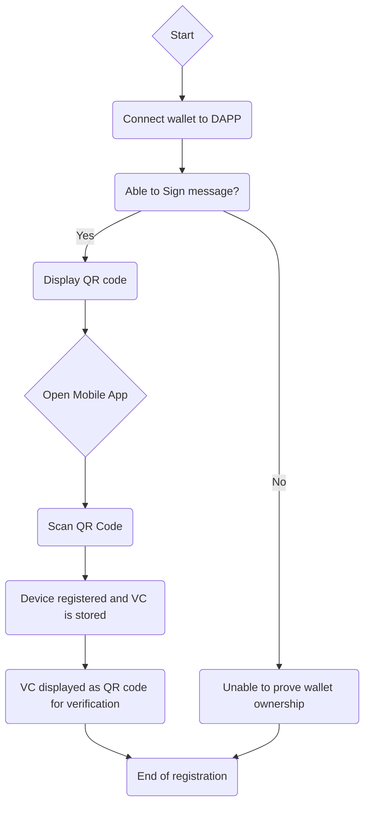
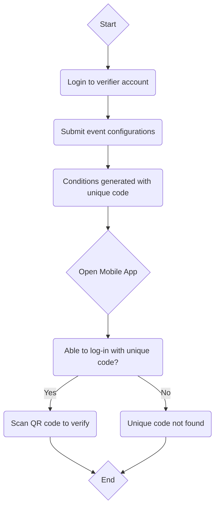

# OpenAttestation Token Gating Website (Proof of concept)

## 📝 Table of Contents
- [About](#about)
- [Getting Started](#getting_started)
- [Installing](#installing)
- [Usage](#usage)
- [References](#references)

## 🧐 About

This POC is to implement a method to use NFTs for token gating events in real life. It will make use of Verifiable Credentials (VC) to prove ownership of a wallet address and to prove ownership of an NFT via the wallet address. VCs issued complies with Singapore OpenAttestation standards (https://www.openattestation.com/).

## 🏁 Getting Started
### Prerequisites
What things you need to install the software and how to install them.

```
Give examples
```

### Installing

In project root folder, open a terminal and run npm install to install the dependencies
```
npm install
```

## 🎈 Usage

### Registration flow


### Verification flow

## ⛏️ Built Using
- [React](https://reactjs.org/) - User Interface
- [Tailwind](https://tailwindcss.com/) - Styling

## 🎉 References
- 